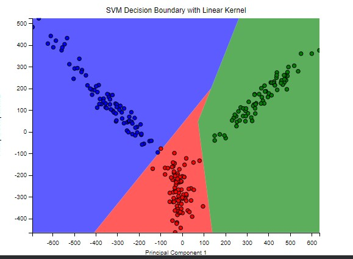
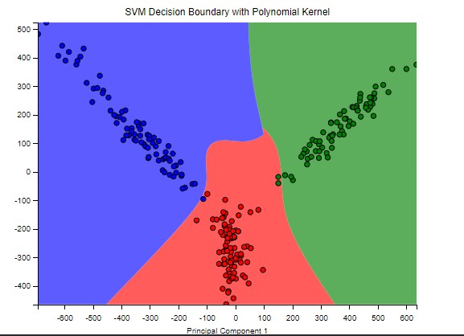
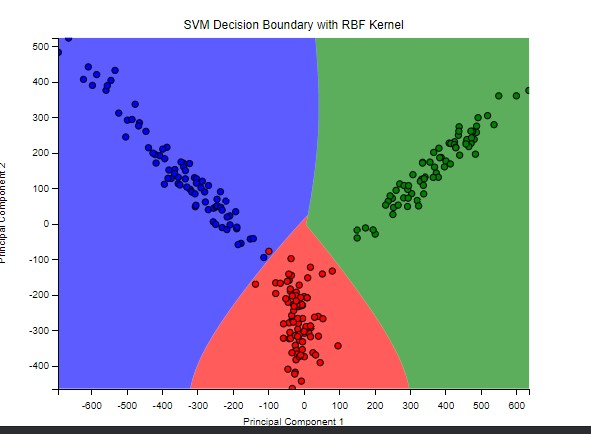
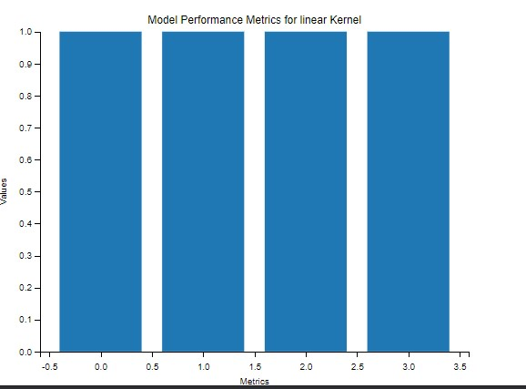
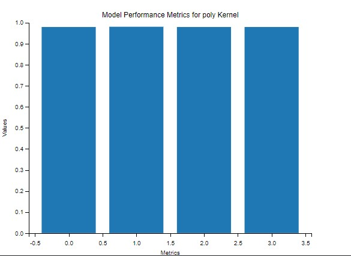
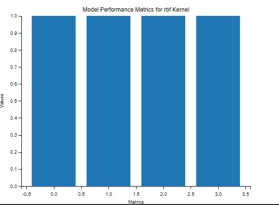

# MultiKernel-SVM-ImageClassifier

This project implements an image classification system using Support Vector Machines (SVMs) with different kernels (linear, polynomial, and RBF). The system leverages a combination of HOG, LBP, and deep CNN features for improved accuracy. It also includes image augmentation and preprocessing steps to enhance the dataset and the quality of the features.

## Project Structure

- `images/`: Directory containing images used in the project.
- `README.md`: Project documentation.
- `requirements.txt`: List of dependencies.
- `Result` : It Contain Results of the model

## Features

- **Image Loading and Labeling**: Load images from a folder and assign labels based on the filenames.
- **Image Augmentation**: Apply random rotations and flips to augment the dataset.
- **Image Preprocessing**: Convert images to grayscale, apply histogram equalization and Gaussian blurring.
- **Feature Extraction**: Extract HOG, LBP, and CNN features from images.
- **Dimensionality Reduction**: Use PCA to reduce the dimensionality of the feature vectors.
- **SVM Training**: Train SVM classifiers with linear, polynomial, and RBF kernels.
- **Model Evaluation**: Evaluate the classifiers using accuracy, precision, recall, and F1-score.
- **Decision Boundary Visualization**: Plot decision boundaries for the first two principal components.
- **Single Image Prediction**: Predict the class of a single image using the trained classifiers.


## Results

### Decision Boundaries
#### Linear Kernel


#### Polynomial Kernel


#### RBF Kernel


### Performance

#### Linear Kernel


#### Poly Kernel



#### RBF Kernel



## Installation

To run this project, you need Python 3.7 or higher. Install the required packages using:

```bash
pip install -r requirements.txt
